# TEleVIZion tutorial

The example dataset is based on the [*Anopheles gambiae sensu stricto*](https://www.ncbi.nlm.nih.gov/datasets/genome/GCF_943734735.2/) mosquito, one of the most important vectors of the malaria parasite *Plasmodium falciparum* in sub-Saharan Africa. It has a haploid genome assembly size of approximately **264.5 million base pairs (Mb)** distributed across three main chromosomes (2RL, 3RL and X).

This tutorial demonstrates the main [TEleVIZion](../README.md) workflows using the example data provided in:

```text
data/examples/
├── annotation_GCF_943734735.2.gff            # hidden (GitHub repository size limits)
├── chroms_metadata_GCA_943734735.2.tsv
├── edta_GCA_943734735.2.gff                  # hidden (GitHub repository size limits)
├── gc_content_GCA_943734735.2_100000.tsv
├── gene_content_GCA_943734735.2_20000.bed
├── genome_GCA_943734735.2.fasta              # hidden (GitHub repository size limits)
├── repeatmasker_GCA_943734735.2.divsum
├── repeatmasker_GCA_943734735.2.out
├── sequence_report.tsv
└── trash_summary_GCA_943734735.2.csv         # hidden (GitHub repository size limits)
```

All commands below should be run from the **root of the TEleVIZion repository**.

Before starting, create the TEleVIZion environment if necessary and activate it:

```bash
conda activate televizion
# or
# source .venv_televizion/bin/activate
```

You can check the available options at any time with:

```bash
python3 scripts/televizion_cli.py --help
```

## 1. A first TEleVIZion analysis

The simplest analysis requires:

1. genome metadata;
2. repeat annotations; and
3. optionally, a name and window size for the analysis.

We will start with the RepeatMasker annotation:

```bash
python3 scripts/televizion_cli.py \
  --name An_gambiae_RepeatMasker \
  --genome data/examples/chroms_metadata_GCA_943734735.2.tsv \
  --repeatmasker data/examples/repeatmasker_GCA_943734735.2.out \
  --windowsize 500000
```

TEleVIZion divides the chromosomes into non-overlapping 500-kb windows, assigns repeat annotations to those windows, resolves overlapping repeat annotations, calculates repeat abundance and generates summary and karyotype plots.

Results are written to:

```text
analyses/An_gambiae_RepeatMasker/
```

Every analysis produces whole-genome summaries of both **insertion count** and **base-pair span**. These measurements are complementary: insertion count measures how frequently repeats occur, whereas base-pair span measures how much genomic sequence they occupy.

| Insertion count | Base-pair span |
|:---:|:---:|
| 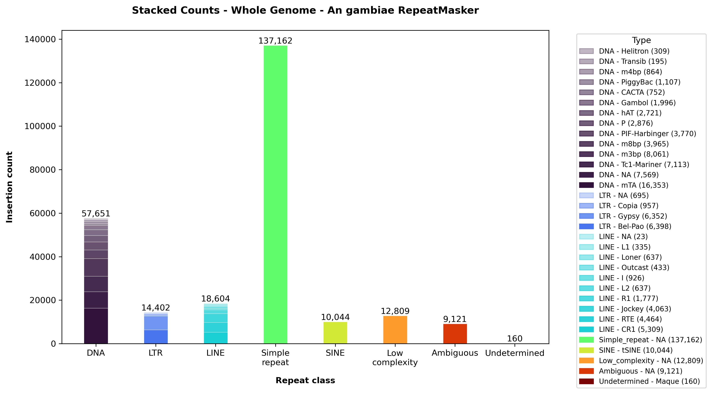 | 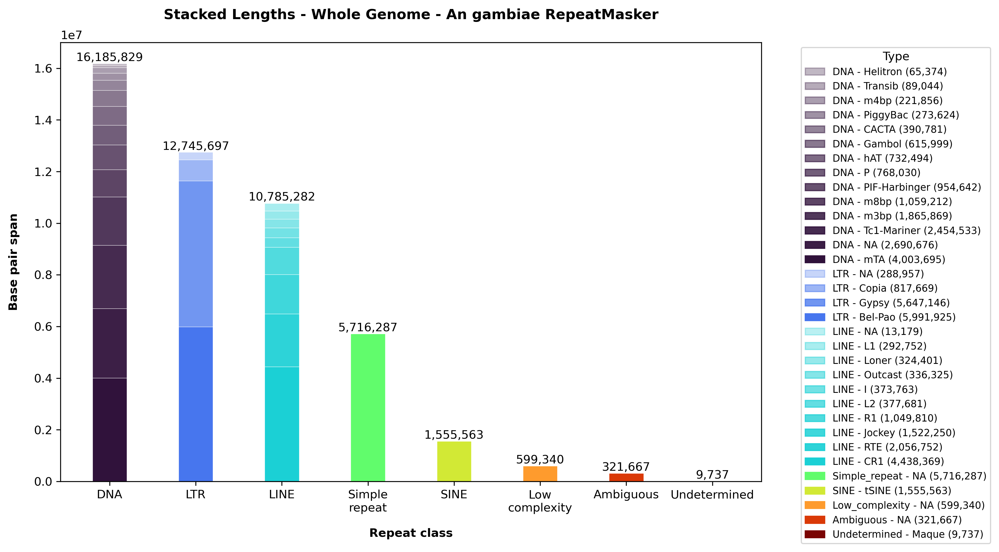 |
| 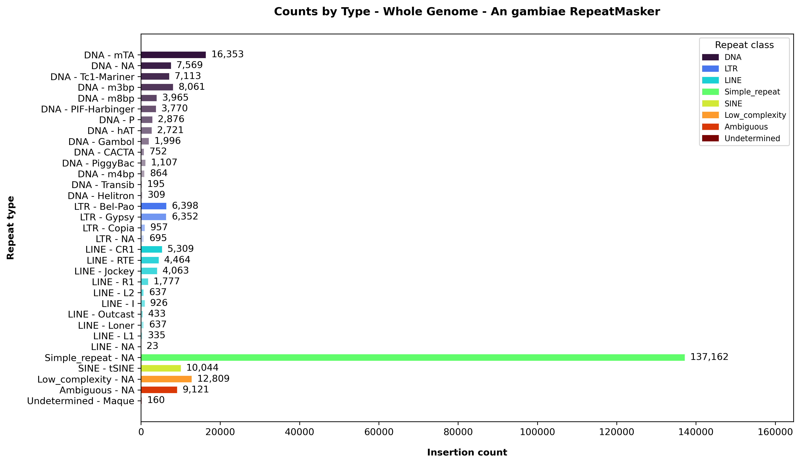 | 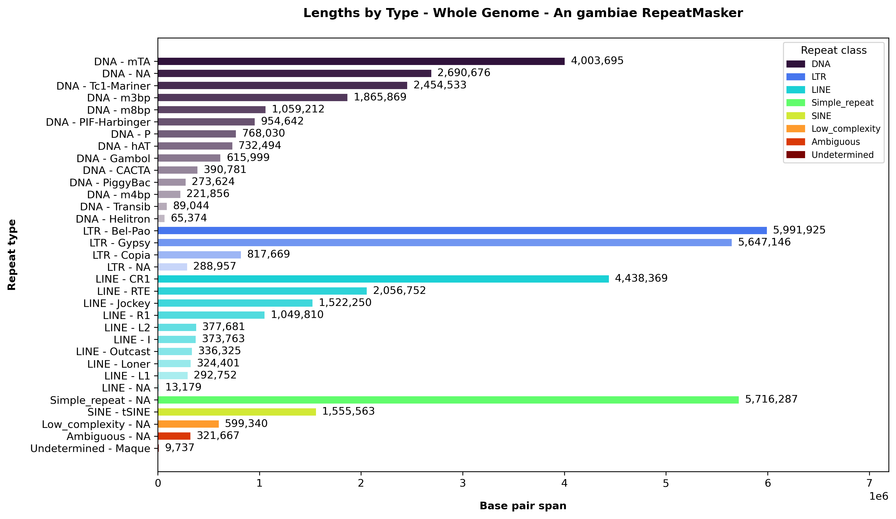 |

The analysis also produces chromosome-scale plots (also known as karyoplots) showing how repeat abundance changes along the genome, in terms of insertion counts and base-pair span. This spatial view can reveal local repeat enrichment or depletion that is hidden by whole-genome summaries.

## 2. Choosing a window size

The `--windowsize` option controls the resolution at which TEleVIZion summarises repeats along the genome.

For example, this uses 100-kb windows instead of 500-kb windows:

```bash
python3 scripts/televizion_cli.py \
  --name An_gambiae_100kb \
  --genome data/examples/chroms_metadata_GCA_943734735.2.tsv \
  --repeatmasker data/examples/repeatmasker_GCA_943734735.2.out \
  --windowsize 100000
```

| 1.5-Mb windows | 500-kb windows | 100-kb windows |
|:---:|:---:|:---:|
| 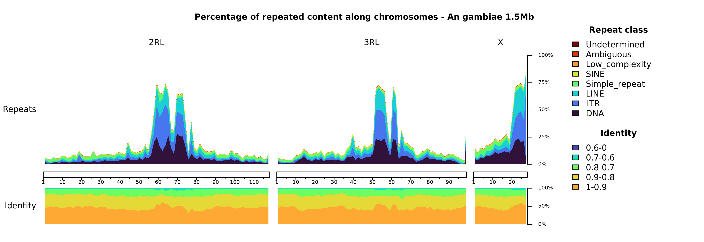 | 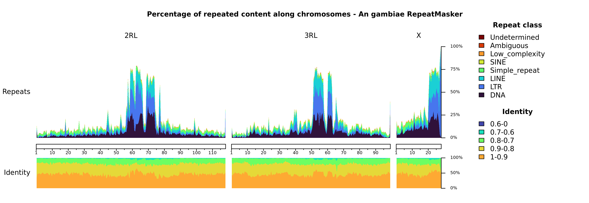 | 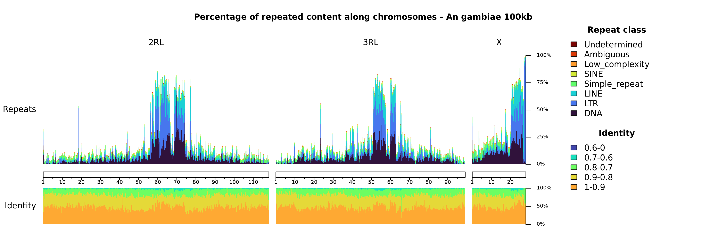 |

Smaller windows provide finer spatial resolution but generate larger intermediate tables and can make plotting slower. Larger windows provide a broader overview of repeat distribution.

A useful strategy is therefore to begin with relatively large windows for a genome-wide overview and decrease the window size when investigating particular genomic regions.

## 3. Analysing EDTA annotations

TEleVIZion can use EDTA annotations instead of RepeatMasker annotations.

The example EDTA file is:

```text
data/examples/edta_GCA_943734735.2.gff
```

Run:

```bash
python3 scripts/televizion_cli.py \
  --name An_gambiae_EDTA \
  --genome data/examples/chroms_metadata_GCA_943734735.2.tsv \
  --edta data/examples/edta_GCA_943734735.2.gff \
  --windowsize 500000
```

For EDTA annotations, TEleVIZion obtains the repeat class and family from the `classification` attribute, the repeat element from `Name`, and match identity from `identity`.

The resulting plots have the same general structure as the RepeatMasker analysis, making outputs from the two annotation approaches easier to compare.

## 4. Analysing TRASH annotations

TEleVIZion also supports TRASH repeat summaries. TRASH support is currently considered **beta**.

The example file is:

```text
data/examples/trash_summary_GCA_943734735.2.csv
```

Run:

```bash
python3 scripts/televizion_cli.py \
  --name An_gambiae_TRASH \
  --genome data/examples/chroms_metadata_GCA_943734735.2.tsv \
  --trash data/examples/trash_summary_GCA_943734735.2.csv \
  --windowsize 500000
```

For TRASH annotations, TEleVIZion uses the genomic region reported by TRASH together with its repeat classification and average score. The average score is used as the identity measure for the corresponding repeated region and consensus sequence.

## 5. Adding RepeatMasker Kimura divergence

For RepeatMasker analyses, a Kimura divergence summary can optionally be supplied using `--kimura`.

The example dataset contains:

```text
data/examples/repeatmasker_GCA_943734735.2.divsum
```

Run:

```bash
python3 scripts/televizion_cli.py \
  --name An_gambiae_RepeatMasker_Kimura \
  --genome data/examples/chroms_metadata_GCA_943734735.2.tsv \
  --repeatmasker data/examples/repeatmasker_GCA_943734735.2.out \
  --kimura data/examples/repeatmasker_GCA_943734735.2.divsum \
  --windowsize 500000
```

Kimura divergence values are grouped into the following bins:

```text
0-10, 10-20, 20-30, 30-40, 40-70
```

The corresponding window-level information is retained in:

```text
analyses/An_gambiae_RepeatMasker_Kimura/karyoplot_tables/
```

If `--kimura` is omitted, RepeatMasker analyses still work. In that case TEleVIZion derives an identity-like measure from the per-insertion percentage divergence reported in the RepeatMasker `.out` file.

| Default | Kimura divergence |
|:---:|:---:|
|  | 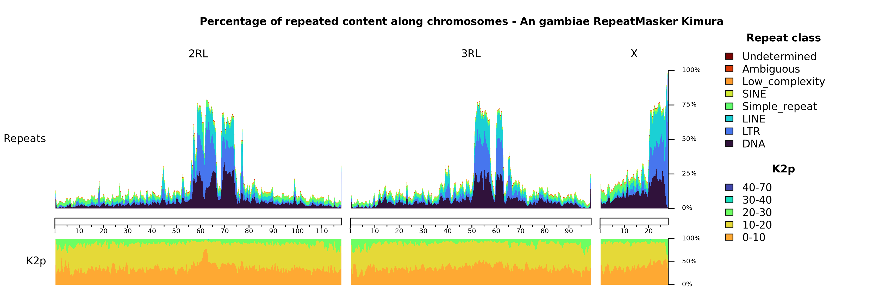 |

## 6. Plotting selected and ordered chromosomes

By default:

```text
--chromtoplot all
```

plots all chromosomes or scaffolds listed in the genome metadata.

To restrict the karyotype to one or more sequences, provide their sequence IDs:

```bash
python3 scripts/televizion_cli.py \
  --name An_gambiae_selected_chromosomes \
  --genome data/examples/chroms_metadata_GCA_943734735.2.tsv \
  --repeatmasker data/examples/repeatmasker_GCA_943734735.2.out \
  --windowsize 500000 \
  --chromtoplot OX030907.1
```

Multiple sequence IDs can be supplied as a comma-separated list:

```text
--chromtoplot OX030907.1,OX030908.1
```

**Important:** `--chromtoplot` expects the sequence IDs from the `chr` column of the genome metadata, not the prettier labels from its `name` column.

## 7. Generating per-chromosome summaries

Whole-genome summary plots combine information across chromosomes. To generate equivalent summary plots independently for each chromosome as well, use:

```text
--perchromosome
```

For example:

```bash
python3 scripts/televizion_cli.py \
  --name An_gambiae_per_chromosome \
  --genome data/examples/chroms_metadata_GCA_943734735.2.tsv \
  --edta data/examples/edta_GCA_943734735.2.gff \
  --windowsize 500000 \
  --perchromosome
```

These figures are written under:

```text
analyses/An_gambiae_per_chromosome/per_chromosome/
```

| Whole genome | 2RL | 3RL | X |
|:---:|:---:|:---:|:---:|
| 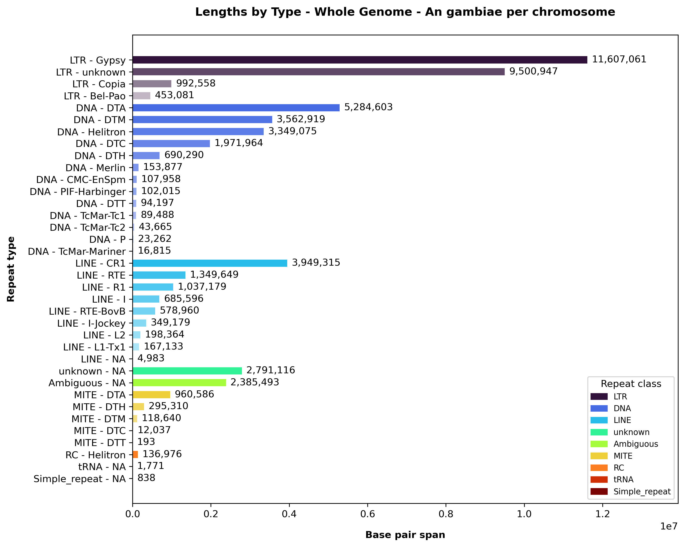 | 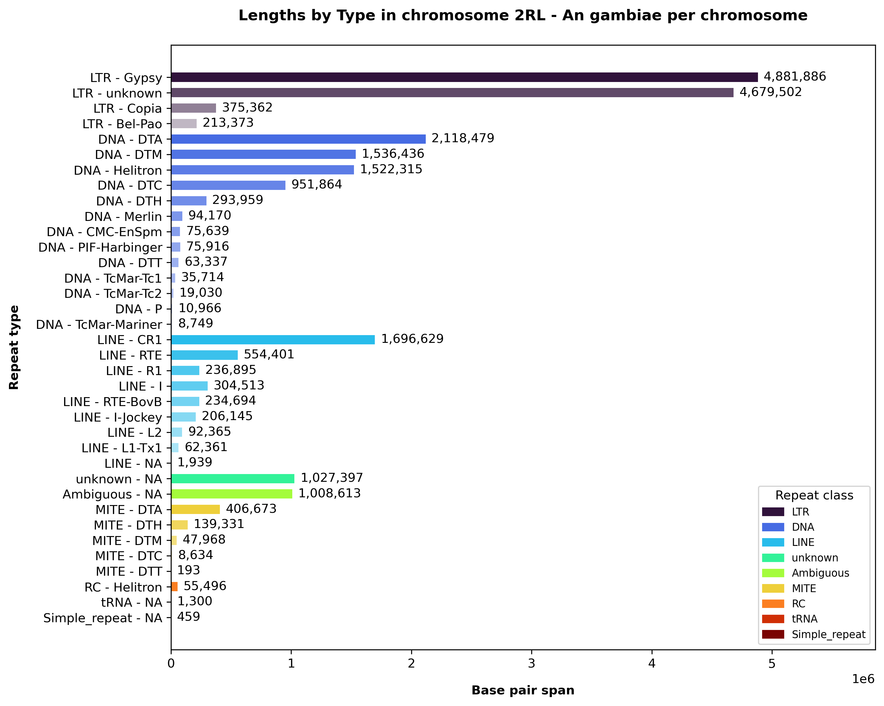 | 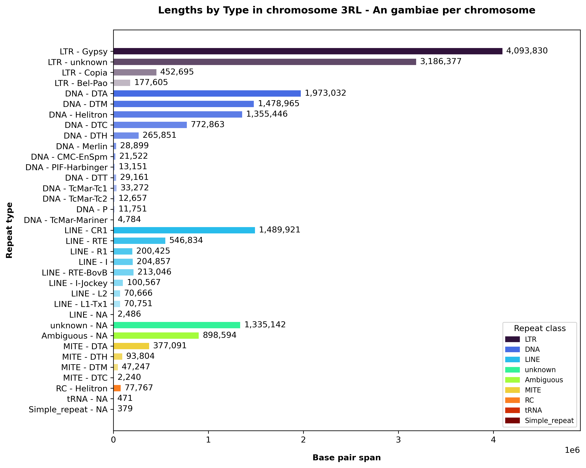 | 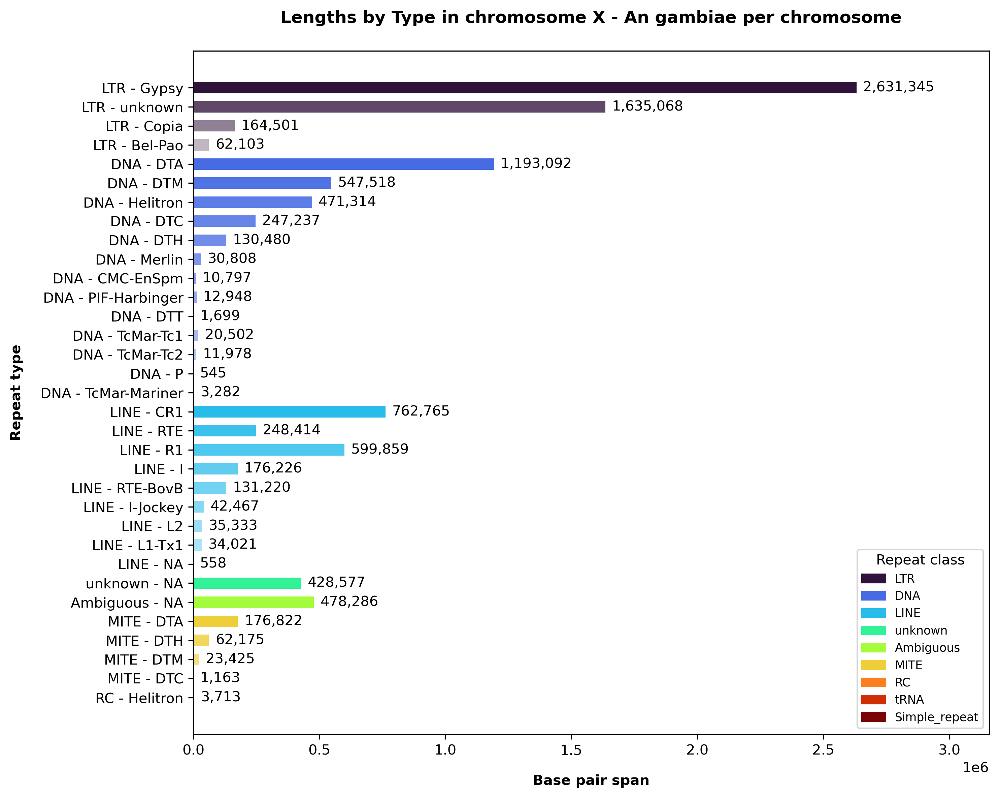 |

## 8. Generating plots for individual repeat classes

The standard karyotype combines repeat classes into the same figure.

Use `--perclass` to generate a separate karyotype for each repeat class as well:

```bash
python3 scripts/televizion_cli.py \
  --name An_gambiae_per_class \
  --genome data/examples/chroms_metadata_GCA_943734735.2.tsv \
  --edta data/examples/edta_GCA_943734735.2.gff \
  --windowsize 500000 \
  --perclass
```

The additional figures are written to:

```text
analyses/An_gambiae_per_class/per_class/
```

| All classes | Individual class |
|:---:|:---:|
| 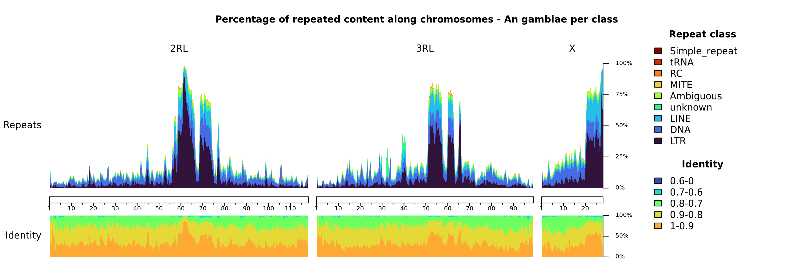 | 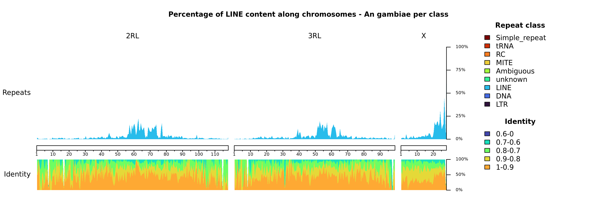 |

These plots make it easier to inspect the genomic distribution of a particular TE class without signals from other repeat classes obscuring the pattern.

## 9. Controlling repeat-class order

TEleVIZion normally determines repeat-class order automatically.

You can explicitly select and order classes using `--classesorder`.

For example:

```bash
python3 scripts/televizion_cli.py \
  --name An_gambiae_class_order \
  --genome data/examples/chroms_metadata_GCA_943734735.2.tsv \
  --edta data/examples/edta_GCA_943734735.2.gff \
  --windowsize 500000 \
  --classesorder LTR,DNA,LINE,MITE,RC,Simple_repeat,tRNA,unknown,Ambiguous
```

This is particularly useful when comparing multiple analyses because the same repeat classes can be displayed in a consistent order.

Only include classes that are appropriate for the annotation dataset being analysed.

## 10. Using a custom colour palette

By default, TEleVIZion assigns repeat-class colours automatically.

A custom palette can instead be supplied with:

```text
--palette
```

The repository includes an example:

```text
data/palettes/personalised_palette_example.tsv
```

Run:

```bash
python3 scripts/televizion_cli.py \
  --name An_gambiae_custom_palette \
  --genome data/examples/chroms_metadata_GCA_943734735.2.tsv \
  --edta data/examples/edta_GCA_943734735.2.gff \
  --windowsize 500000 \
  --palette data/palettes/personalised_palette_example.tsv
```

A palette file contains six columns:

1. colour name;
2. red value;
3. green value;
4. blue value;
5. HEX colour code;
6. repeat class or class aliases.

Custom palettes are especially useful when figures from several TEleVIZion analyses will be compared side-by-side.

When combining `--palette` with `--classesorder`, make sure every selected class has a corresponding colour in the palette.

## 11. Adding GC content

Repeat distribution can be interpreted alongside genomic context.

The example dataset includes pre-computed GC content:

```bash
python3 scripts/utils/create_gc_content.py \
  data/examples/genome_GCA_943734735.2.fasta \
  --window 100000 \
  --out data/examples/gc_content_GCA_943734735.2_100000.tsv
```

Add the [output](data/examples/gc_content_GCA_943734735.2_100000.tsv) with `--gc`:

```bash
python3 scripts/televizion_cli.py \
  --name An_gambiae_GC \
  --genome data/examples/chroms_metadata_GCA_943734735.2.tsv \
  --repeatmasker data/examples/repeatmasker_GCA_943734735.2.out \
  --windowsize 500000 \
  --gc data/examples/gc_content_GCA_943734735.2_100000.tsv
```

<p align="center">
  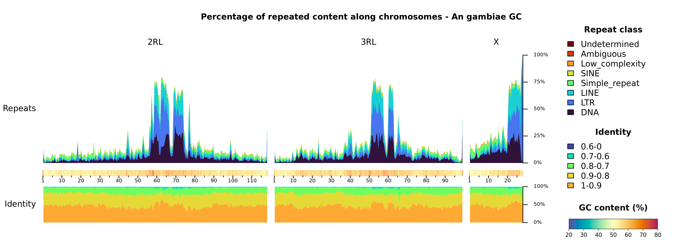
</p>

The window size of the contextual track does not have to be the same as the TEleVIZion `--windowsize`; the supplied file already contains its genomic intervals.

## 12. Adding gene content

Gene density can alternatively be shown alongside the repeat landscape.

The example gene-content track can be generated with:

```bash
python3 scripts/utils/create_gene_content.py \
  data/examples/chroms_metadata_GCA_943734735.2.tsv \
  data/examples/annotation_GCF_943734735.2.gff \
  --window 20000 \
  --sequence-report data/examples/sequence_report.tsv \
  --out data/examples/gene_content_GCA_943734735.2_20000.bed
```

Use the resulting [output](data/examples/gene_content_GCA_943734735.2_20000.bed) to run:

```bash
python3 scripts/televizion_cli.py \
  --name An_gambiae_gene_content \
  --genome data/examples/chroms_metadata_GCA_943734735.2.tsv \
  --repeatmasker data/examples/repeatmasker_GCA_943734735.2.out \
  --windowsize 500000 \
  --gene-content data/examples/gene_content_GCA_943734735.2_20000.bed
```

This allows repeat abundance to be visually compared with gene-rich and gene-poor regions.

`--gc` and `--gene-content` are mutually exclusive, so only one contextual track can be displayed in a single run.

## 13. Zooming into a genomic region

Genome-wide plots are useful for identifying interesting regions. TEleVIZion can then generate a higher-resolution view with `--zoom`.

The syntax is:

```text
--zoom chromosome:start-end
```

For example, to inspect positions 60–80 Mb on `OX030907.1`:

```bash
python3 scripts/televizion_cli.py \
  --name An_gambiae_zoom \
  --genome data/examples/chroms_metadata_GCA_943734735.2.tsv \
  --edta data/examples/edta_GCA_943734735.2.gff \
  --windowsize 50000 \
  --zoom OX030907.1:60000000-80000000
```

<p align="center">
  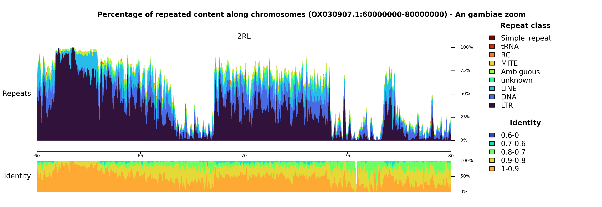
</p>

Here a smaller 50-kb window is used to provide greater resolution within the selected interval.

When using `--zoom`, choose a window size that produces several windows within the region. A 20-Mb interval plotted with 10-Mb windows, for example, would provide very little spatial detail.

## 14. Changing the karyotype layout

Karyotype plots use a horizontal chromosome arrangement by default:

```text
--layout horizontal
```

Vertical layouts can be useful when plotting many chromosomes or when preparing figures for page layouts with limited horizontal space. You can request a vertical arrangement with:

```bash
python3 scripts/televizion_cli.py \
  --name An_gambiae_vertical \
  --genome data/examples/chroms_metadata_GCA_943734735.2.tsv \
  --edta data/examples/edta_GCA_943734735.2.gff \
  --windowsize 500000 \
  --layout vertical
```

<p align="center">
  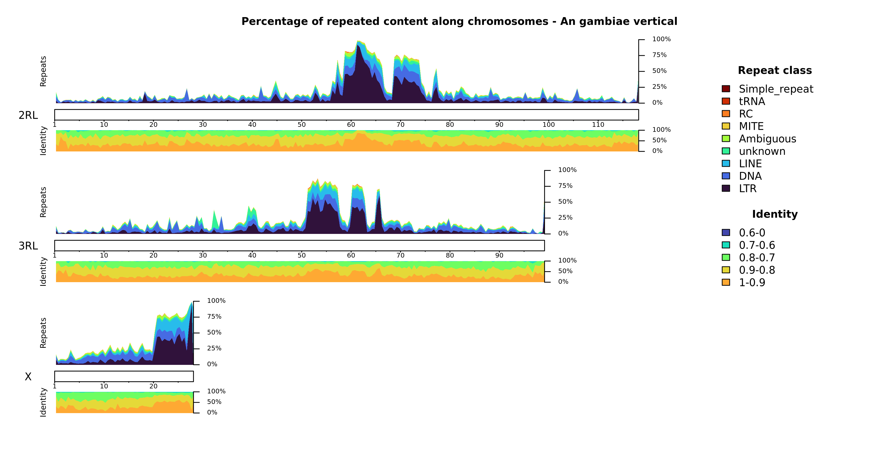
</p>

## 15. Changing the size of summary figures

The dimensions of the Python-generated general-statistics figures can be controlled with:

```text
--figsize W,H
```

For example:

```bash
python3 scripts/televizion_cli.py \
  --name An_gambiae_large_figures \
  --genome data/examples/chroms_metadata_GCA_943734735.2.tsv \
  --repeatmasker data/examples/repeatmasker_GCA_943734735.2.out \
  --windowsize 500000 \
  --figsize 14,10
```

Dimensions are specified in inches.

`--figsize` affects the Python summary plots and does not control the dimensions of the karyoploteR figures.

## 16. Selecting output formats

By default, figures are written as PDF:

```text
--output-formats pdf
```

You can request PNG:

```bash
python3 scripts/televizion_cli.py \
  --name An_gambiae_png \
  --genome data/examples/chroms_metadata_GCA_943734735.2.tsv \
  --repeatmasker data/examples/repeatmasker_GCA_943734735.2.out \
  --windowsize 500000 \
  --output-formats png
```

Or generate several formats in the same run:

```bash
python3 scripts/televizion_cli.py \
  --name An_gambiae_multiple_formats \
  --genome data/examples/chroms_metadata_GCA_943734735.2.tsv \
  --repeatmasker data/examples/repeatmasker_GCA_943734735.2.out \
  --windowsize 500000 \
  --output-formats pdf,png,jpg
```

Supported formats are:

```text
pdf, png, jpg
```

## 17. Controlling raster resolution

For PNG and JPG output, the resolution is controlled with `--dpi`.

For example:

```bash
python3 scripts/televizion_cli.py \
  --name An_gambiae_high_resolution \
  --genome data/examples/chroms_metadata_GCA_943734735.2.tsv \
  --repeatmasker data/examples/repeatmasker_GCA_943734735.2.out \
  --windowsize 500000 \
  --output-formats png \
  --dpi 600
```

The default is 300 DPI, and values below 300 are rejected.

A higher DPI can be useful when producing raster figures for publication or when figures will be enlarged.

## 18. Combining options

The options above are designed to be combined.

For example, a more customised EDTA analysis could use:

```bash
python3 scripts/televizion_cli.py \
  --name An_gambiae_EDTA_detailed \
  --genome data/examples/chroms_metadata_GCA_943734735.2.tsv \
  --edta data/examples/edta_GCA_943734735.2.gff \
  --windowsize 100000 \
  --gc data/examples/gc_content_GCA_943734735.2_100000.tsv \
  --chromtoplot OX030907.1,OX030908.1,OX030909.1 \
  --perchromosome \
  --perclass \
  --layout vertical \
  --figsize 14,10 \
  --output-formats pdf,png \
  --dpi 600
```

<p align="center">
  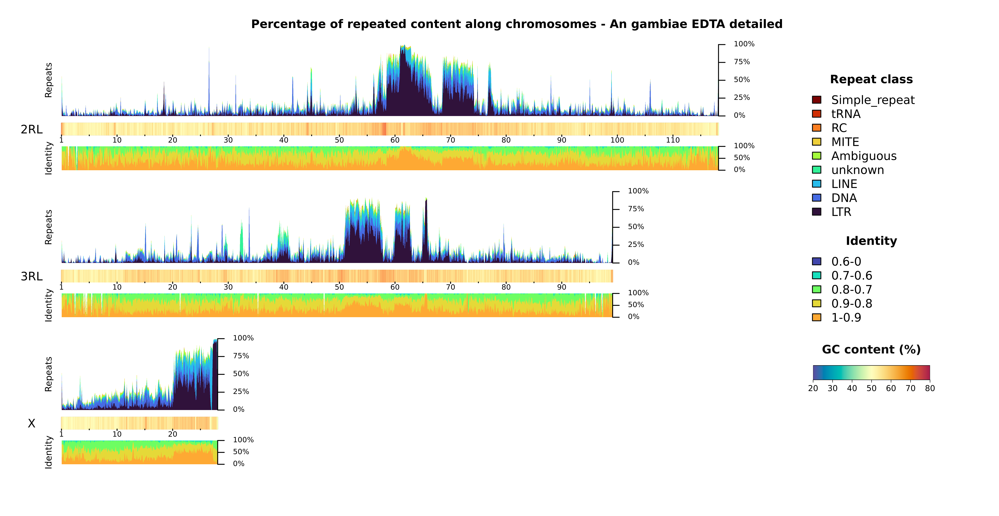
</p>

This run:

- uses EDTA annotations;
- reorders the chromosomes;
- aggregates repeats into 100-kb windows;
- adds GC content as genomic context;
- generates per-chromosome summary plots;
- generates individual repeat-class karyotypes;
- uses a vertical karyotype layout;
- enlarges the Python summary figures;
- generates both PDF and PNG figures;
- renders raster output at 600 DPI.

Combining options in this way makes it possible to move from a quick exploratory analysis to figures tailored for a particular biological question.

## 19. Creating the input tracks yourself

The files under `data/examples/` are already prepared, so you do not need to generate them to complete this tutorial. For a new genome, however, TEleVIZion provides helper scripts for constructing the required metadata and contextual tracks.

### Genome metadata

A starter chromosome metadata table can be generated from the FASTA used for repeat annotation with:

```bash
python3 scripts/utils/create_chroms.py --help
```

```text
data/examples/sequence_report.tsv
```

This file provides an example of an [NCBI sequence report](../images/ncbi_sequence_report.png) that can be used when preparing chromosome metadata where appropriate (i.e. `chr` → `name`).

### GC content

Generate a GC-content track with:

```bash
python3 scripts/utils/create_gc_content.py --help
```

### Gene content

Gene content can be calculated from a genome annotation GFF using:

```bash
python3 scripts/utils/create_gene_content.py --help
```

## 20. Where to go next

A useful progression when exploring a new genome is:

1. **Start broad.** Run TEleVIZion with RepeatMasker or EDTA and a relatively large window size.
2. **Inspect abundance.** Compare insertion counts with base-pair span to determine whether repeat abundance is driven by numerous short insertions or fewer long insertions.
3. **Inspect spatial patterns.** Use the karyotype plots to identify repeat-rich or repeat-poor genomic regions.
4. **Separate chromosomes and classes.** Use `--perchromosome` and `--perclass` when genome-wide plots hide interesting patterns.
5. **Add genomic context.** Use GC or gene content to compare repeat landscapes with other genome features.
6. **Zoom in.** Once an interesting region is identified, rerun TEleVIZion with a smaller window size and `--zoom`.
7. **Standardise comparative figures.** When comparing genomes or annotation methods, use `--chromtoplot`, `--classesorder`, `--palette`, `--figsize`, `--layout`, `--output-formats`, and `--dpi` to keep visualisation choices consistent.

